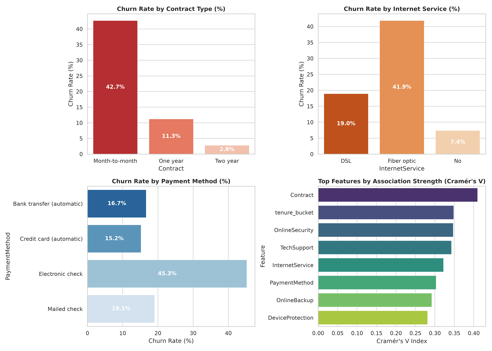
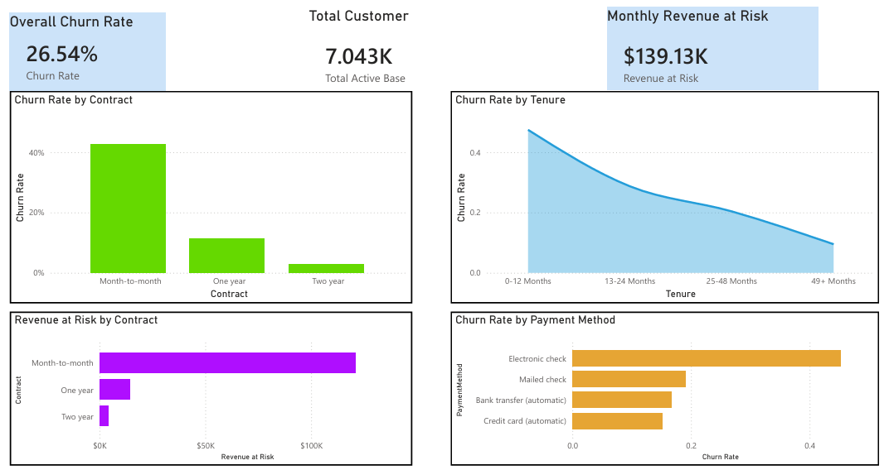

# Customer Churn & Retention Analysis


## 1. Business Problem
Subscription-based businesses lose significant recurring revenue to customer churn. This project
identifies which customer segments are most likely to churn, quantifies the revenue at risk, and
recommends targeted retention actions — presented the way a Business Analyst would pitch it to a
Customer Success leadership team, not the way a data scientist would present a model.

## 2. Key Findings

Across an active base of **7,043 accounts**, overall churn stands at **26.54%** (1,869 lost
customers), putting **$139,130.85/mo** ($1.67M ARR) at risk.

| Driver | Churn Rate | Revenue at Risk | Association Strength (Cramér's V) |
| :--- | :---: | :---: | :--- |
| Month-to-Month Contracts | 42.71% | $113,382.45/mo | Very Strong (0.41) |
| Electronic Check Payment | 45.29% | $79,271.65/mo | Strong (0.30) |
| Fiber Optic Internet Service | 41.89% | $107,762.60/mo | Strong (0.32) |

**Headline recommendation:** a 10% reduction in Month-to-Month churn (166 retained accounts)
protects **$136,058.94 in Annualized Recurring Revenue**.

Full writeup with root-cause analysis and three recommended retention actions:
[`deliverables/executive_memo.md`](deliverables/executive_memo.md) ([PDF version](deliverables/executive_memo.pdf)).




## 3. Dataset
**Source:** Telco Customer Churn dataset (Kaggle) —
https://www.kaggle.com/datasets/blastchar/telco-customer-churn

**Contents:** ~7,043 customer rows with:
- Demographics: gender, SeniorCitizen, Partner, Dependents
- Account info: tenure, Contract, PaperlessBilling, PaymentMethod, MonthlyCharges, TotalCharges
- Services: PhoneService, MultipleLines, InternetService, OnlineSecurity, OnlineBackup,
  DeviceProtection, TechSupport, StreamingTV, StreamingMovies
- Target: Churn (Yes/No)

## 4. Repo Structure
```
customer-churn-retention-analysis/
├── README.md
├── data/
│   ├── raw/                          # original Kaggle CSV, untouched
│   │   └── WA_Fn-UseC_-Telco-Customer-Churn.csv
│   └── processed/                    # cleaned data used downstream
│       ├── churn_clean.csv
│       ├── churn.db                  # SQLite DB loaded from churn_clean.csv
│       └── segment_churn_summary.csv
├── sql/
│   ├── 01_schema.sql                 # table + indexes
│   ├── 02_segmentation.sql           # segment-level customer/revenue breakdowns
│   └── 03_churn_rate_by_segment.sql  # churn rate & revenue-at-risk by segment
├── notebooks/
│   ├── 01_data_cleaning.ipynb        # cleaning, feature engineering
│   └── 02_eda_churn_drivers.ipynb    # chi-square + Cramér's V driver ranking, charts
├── excel/
│   └── churn_revenue_whatif.xlsx     # adjustable what-if revenue model
├── dashboard/
│   ├── churn_dashboard.pbix          # Power BI dashboard
│   └── screenshots/
└── deliverables/
    ├── executive_memo.md             # final business recommendation write-up
    └── executive_memo.pdf
```

## 5. How It Was Built

### Phase 1 — Data Prep (Python)
Cleaned `TotalCharges` blanks (customers with `tenure == 0`), standardized "No internet service"
categorical values, and engineered `tenure_bucket`, `num_services`, and `is_high_value` features.
Output: `data/processed/churn_clean.csv`.

### Phase 2 — SQL Segmentation
Loaded the cleaned CSV into a local SQLite database (`data/processed/churn.db`) and wrote
segmentation and churn-rate queries by Contract, Tenure Bucket, Internet Service, and Payment
Method.

### Phase 3 — EDA & Churn Drivers (Python)
Ran a Chi-Square test of independence against `Churn` for every categorical feature, ranked by
Cramér's V, and translated the top 3 drivers into plain business language.

### Phase 4 — Excel What-If Model
Built `excel/churn_revenue_whatif.xlsx` with a live, editable input cell (`WhatIf_Model!B8`) for
the target churn-reduction %, flowing through to retained-account count and Annualized Revenue
Saved, plus a sensitivity matrix across 5%–25% reduction scenarios.

### Phase 5 — Power BI Dashboard
Connected Power BI to the cleaned dataset and built churn-rate-by-segment, revenue-at-risk-by-segment,
churn-by-tenure-bucket, and overall KPI card visuals. Screenshots in `dashboard/screenshots/`.

### Phase 6 — Executive Memo
Wrote `deliverables/executive_memo.md`, leading with the revenue number and closing with three
retention actions tied directly to the churn drivers. Audience: VP of Customer Success.

## 6. Reproducing the Analysis
```bash
# 1. Data cleaning
jupyter nbconvert --to notebook --execute notebooks/01_data_cleaning.ipynb

# 2. Load cleaned data into SQLite and run segmentation queries
sqlite3 data/processed/churn.db < sql/01_schema.sql
sqlite3 data/processed/churn.db < sql/02_segmentation.sql
sqlite3 data/processed/churn.db < sql/03_churn_rate_by_segment.sql

# 3. Driver analysis / EDA
jupyter nbconvert --to notebook --execute notebooks/02_eda_churn_drivers.ipynb
```
Open `excel/churn_revenue_whatif.xlsx` and edit cell `WhatIf_Model!B8` to test other churn-reduction
targets. Open `dashboard/churn_dashboard.pbix` in Power BI Desktop to explore the dashboard.

## 7. Tools
Python (pandas, matplotlib/seaborn, scipy for the chi-square driver test), SQL (SQLite), Excel,
Power BI
